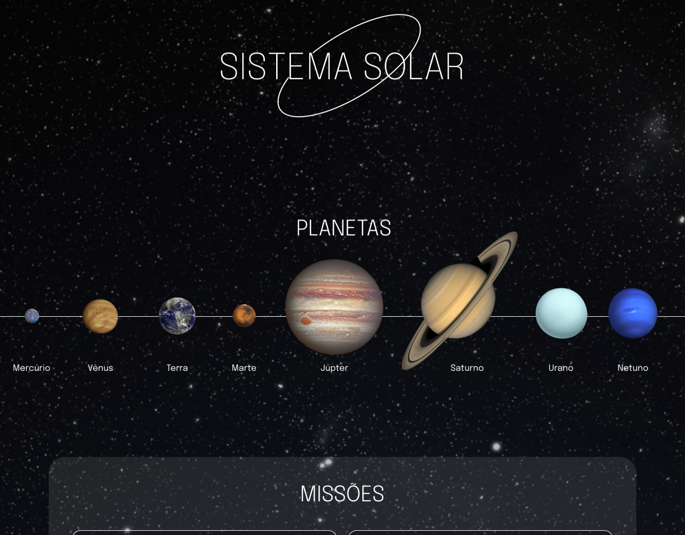

# Projeto Solar System

## 📱 Projeto

Este projeto exibe os planetas do sistema solar e algumas missões feitas por agências espaciais e seus paises.



### 📋 Pré-requisitos

Para conseguir seguir este README e rodar o projeto você pode precisar dos seguintes itens:

- [Git](https://git-scm.com/doc)
- [Node](https://nodejs.org/en/)
- [Npm](https://docs.npmjs.com/about-npm)

## 🚀 Começando

Para ter acesso aos arquivos do projeto você pode clonar usando o seguinte comando:

```
git clone git@github.com:yMaatheus/project-solar-system.git
```

### 🔧 Instalação

Agora que já tem a pasta do projeto na sua máquina, dentro dela instale as dependências:

```
npm install
```

Então podemos rodar o projeto:

```
npm start
```

## 🛠️ Construído com

* [Npm](https://docs.npmjs.com/about-npm) - Gerente de dependências
* [JavaScript](https://developer.mozilla.org/pt-BR/docs/Web/JavaScript) - Linguagem de programação
* [React](http://www.dropwizard.io/1.0.2/docs/) - O framework web
* [Styled Components](https://styled-components.com) - Biblioteca para estilização por componentes
